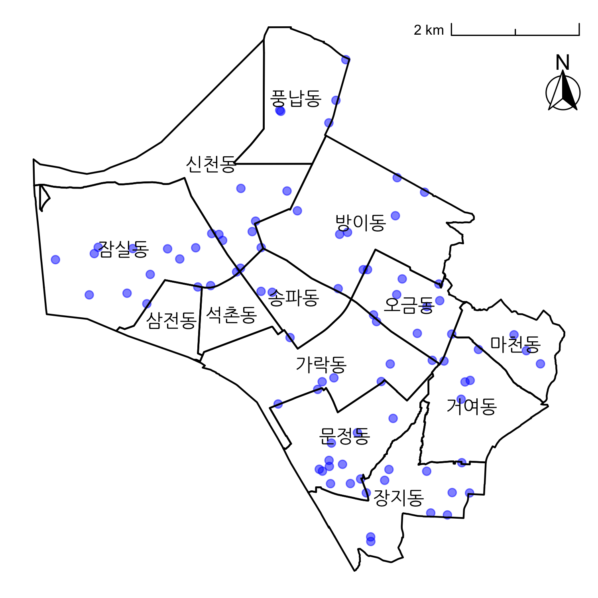
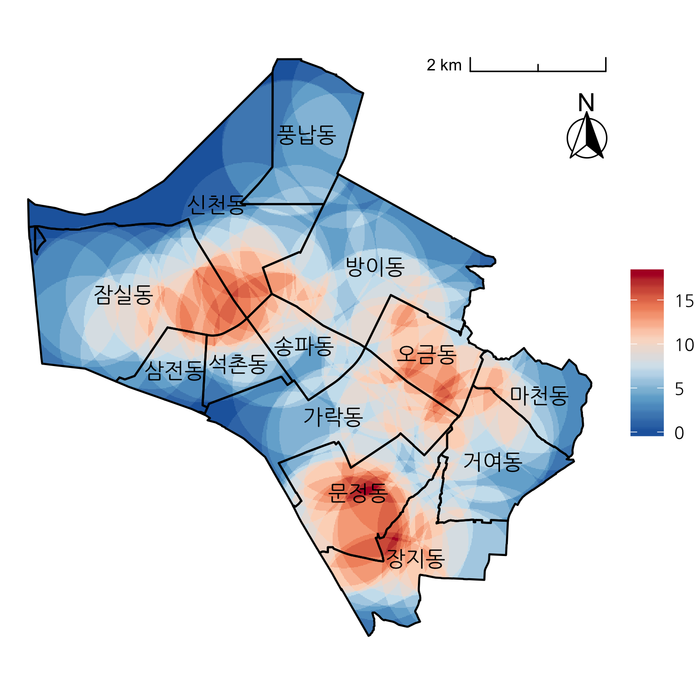
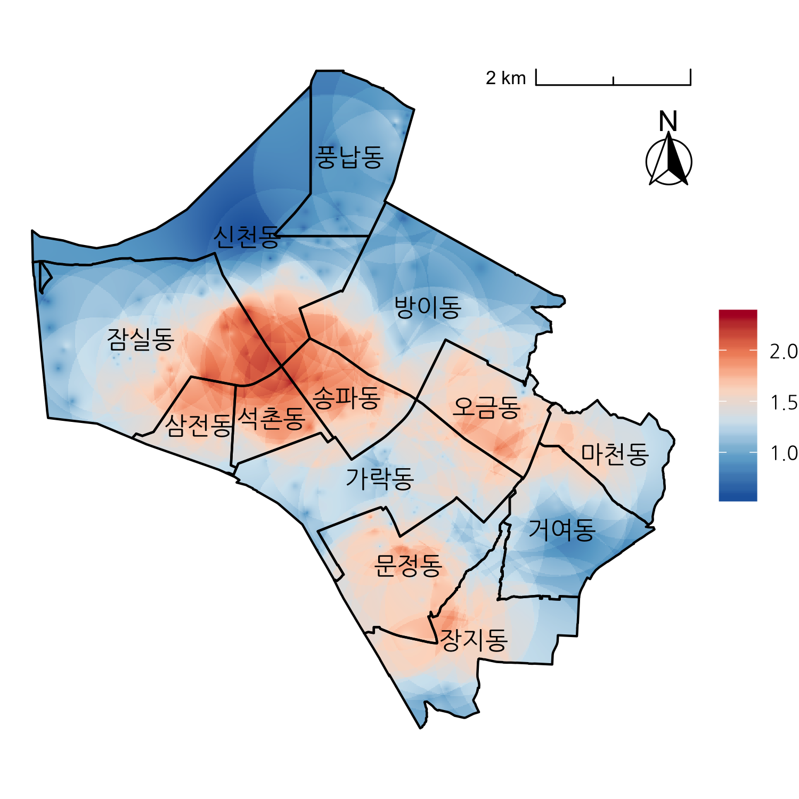

농촌지리정보시스템 및 원격탐사 수업에서 GIS기반 공간정보분석 실습을 위해 진행한 프로젝트입니다.

아래는 프로젝트 요약입니다. 전체 내용은 [presentation.pdf](doc/presentation.pdf)에서 볼 수 있습니다.

## Data

1. 우리나라 지도 shape 파일 → 송파구만 추출
2. 송파구 동별 인구 → 동별 면적으로 나눠서 인구밀도로 변환
3. 서울 유동인구 → 송파구만 추출
4. 송파구 따릉이 대여소 위치

(그림: 왼쪽부터 동별 인구밀도, 지점별 유동인구, 자전거 대여소)

## Interpolation

모든 지점에서의 값을 얻기 위해 10m 간격으로 격자를 만들고, GIS 보간 기법인 IDW(Inverse Distance Weighting)와 KDE(Kernel Density Estimation)를 적용했습니다.

- 인구밀도: IDW
- 유동인구: IDW
- 따릉이 대여소: KDE (커널 함수: 1km 반경 내에 위치한 따릉이 대여소 개수)

유동인구는 극단값을 보정하기 위해 (*x* → *x0.25*)로 변환했습니다.

(그림: 왼쪽부터 인구밀도 IDW 결과, 유동인구 IDW 결과, 따릉이 대여소 KDE 결과)

## Score

보간을 통해 얻은 3개의 raster 자료를 각각 최소값이 0, 최대값이 1이 되도록 정규화하고, 이들을 모두 합해서 헬멧 대여소 적합 점수를 계산했습니다.

*(Score) = (인구밀도) + (유동인구) + (따릉이 대여소 밀집도)*

(그림: 헬멧 대여소 적합 점수)

- 점수가 높은 구역
    + 석촌호수 주변
    + 성내천 주변
    + 문정역/장지역 주변

## 참고자료

R에서 GIS 분석하기: [GIS in R](http://www.nickeubank.com/gis-in-r/)

ggplot으로 그린 지도에 방위표, 축척 넣기: [Drawing beautiful maps programmatically with R, sf and ggplot2](https://www.r-spatial.org/r/2018/10/25/ggplot2-sf.html)

ggplot에서 한글 깨짐 현상 해결: [(참고) ggplot, 한국어 출력 가능한 폰트 확인](https://dalulu.tistory.com/22)
